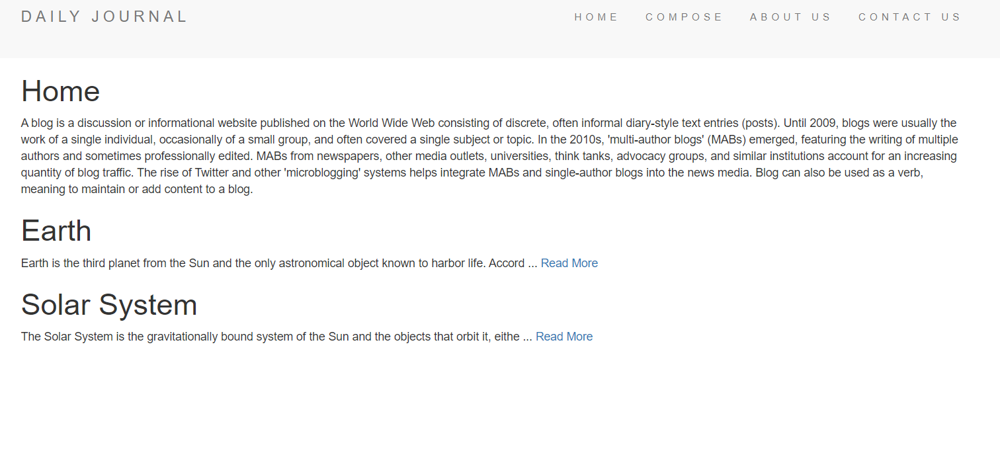
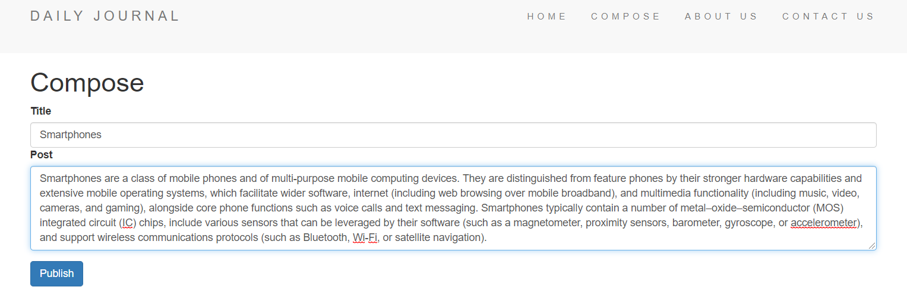
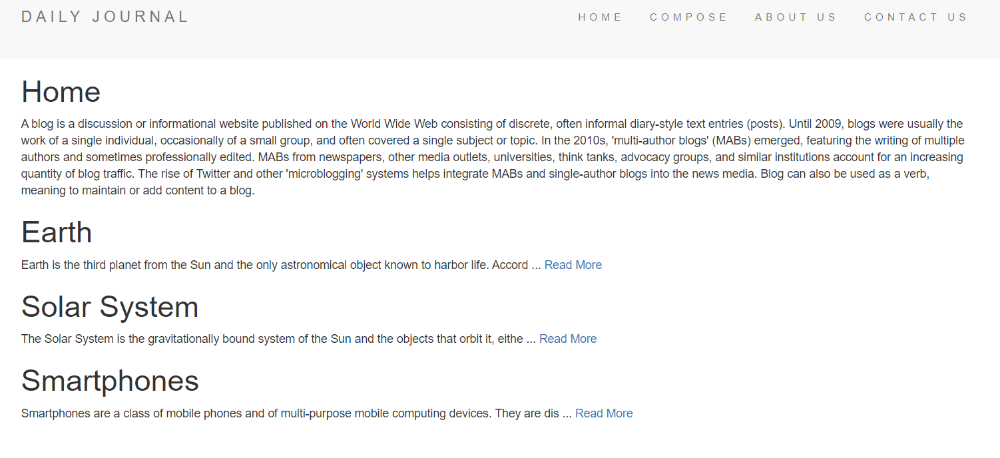

# Daily Journal Blog Website
:pencil: A blog website where the user can post their blog.

# General Information
The website is developed to post blogs along with the title of the blog. The home page shows a 100 letter summary of the blog followed by a **Read More** link.

# Technologies
* Used HTML5, CSS3, Bootstrap and JavaScript to develop the front-end
* Node.js and Express.js to create server and develop back-end
* Used MongoDB (Mongoose) as the database
* EJS as the template engine
* Lodash as a utility function

# Getting Started
* The home page shows all the blogs that are posted on the website
* To compose a blog, the user can click on **compose** from the links given in the navigation bar
* In the compose page, the user needs to enter a title of the blog and then the main content of the blog
* To post the blog, user needs to click on the publish button
* When the blog is published, the user is redirected to the home page, where the new blog is added along with the existing blogs
* On the home page, the user can click on **About us** to know more about the developers and **Contact us** to get in touch with developers 

# Screenshots
* **Home**

* **Compose Page**

* **Home page after blog is published**

* **Reading a particular blog**

